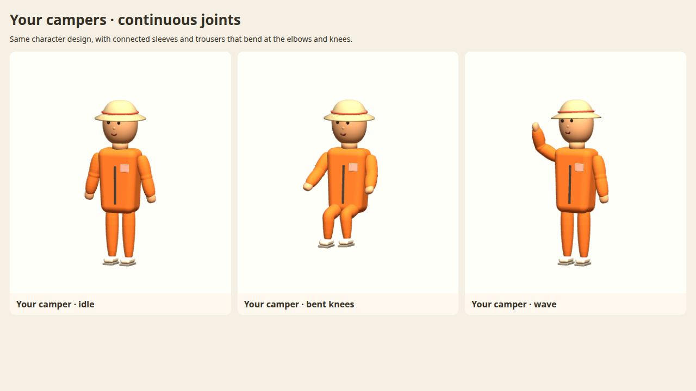

# Claude: improved camper models, animations and physics integration

**Start here. JT approved his existing character design with continuously skinned elbows and knees, then asked
for the little elbow circles to be removed. The finished models and their runtime integration are on `jt/next`.**
Repo: `hole-dig-dev/camp-green-lake`. Asset implementation: `ce2ee49`; smooth elbow update: `ab6bc97`.
Both are included in `be0dec8` and later `jt/next` commits. Pull the latest branch before working.

## What JT wants you to do

Use this camper and its embedded animations throughout the game. Verify that the local player, remote players,
all human NPCs, held objects and physics behave correctly. Bring the complete asset **and its integration** into
any older branch you are working on. On current `jt/next` they are already installed; audit and fix any remaining
issues there. Keep JT's chosen face, clothing, hats, proportions and NPC variations.

## Exact files

| File | Purpose |
| --- | --- |
| [public/models/camper.glb](public/models/camper.glb) | Finished game model, wardrobe, skeleton, skin weights and all 13 animation clips in one GLB |
| [art/blender/characters.blend](art/blender/characters.blend) | Native Blender source, scene `Camper`; generated rig/skins are in the `Export` collection (hidden after export) |
| [blender/cgl_rig.py](blender/cgl_rig.py) | Continuous limb surfaces, skin weights, 12-bone rig, animations, hand-target solvers and export |
| [blender/cgl_helpers.py](blender/cgl_helpers.py) | JT's authored face, torso, hands, sneakers, wardrobe and palette |
| [art/blender/camper_export.py](art/blender/camper_export.py) | Rebuild/export entry point; saves the Blender source compressed |
| [public/js/25-people.js](public/js/25-people.js) | Shared camper loader, independent skeleton clones, body variants, materials, animation mixer; GLB cache version is `v=7` |
| [public/js/26-ragdoll.js](public/js/26-ragdoll.js) | 15-point ragdoll, including both knees; joint aiming and recovery reset |
| [tests/camper-rig.mjs](tests/camper-rig.mjs) | Exported skin topology, weights, knee tracks and clip checks; included in `npm test` |
| [scripts/verify-camper-joints.mjs](scripts/verify-camper-joints.mjs) | Actual game runtime validation and desktop/phone preview capture |
| [docs/art/camper-continuous-joints.md](docs/art/camper-continuous-joints.md) | Art details, rebuild instructions and preview |



## Integration details to preserve

- Four connected skinned surfaces: `CGLCamper_L_Sleeve`, `CGLCamper_R_Sleeve`, `CGLCamper_L_Leg`,
  `CGLCamper_R_Leg`. The elbow circles and old capsule ridges have been removed from the final sleeves.
- Blender bones: `root`, `hips`, `spine`, `head`, `arm.L`, `arm.R`, `forearm.L`, `forearm.R`, `leg.L`,
  `leg.R`, `shin.L`, `shin.R`. Three.js sanitizes dotted names to `armL`, `forearmL`, `legL`, `shinL`, etc.
- Animation clips: `Idle`, `Walk`, `Run`, `Dig`, `Jump`, `KO`, `Drink`, `WipeSweat`, `Dance`, `Wave`,
  `Radio`, `Sit`, `SitEdge`. They live inside the GLB. Walk/Run lift the trailing foot with a knee bend;
  Jump tucks the knees; Sit lets the lower legs hang. JT's straight-out tailgate pose remains in SitEdge.
- Limb thickness variants operate on cloned geometry in the skeleton's bind space. Applying the old rigid
  object scaling to skinned sleeves/trousers moves them away from their joints. Preserve `SkeletonUtils.clone`
  and the width adjustment in `upgradePerson`; each camper needs its own skeleton.
- The ragdoll has knee points `RP.knL=13`, `RP.knR=14`, with the original point indices unchanged. Thighs aim
  hip-to-knee and shins knee-to-foot. Reset shin bones along with the other ragdoll bones on recovery.
- Hands stay named rigid pieces attached to forearms; sneakers ride on shins. Preserve `CGLCamper_L_Hand`
  and `CGLCamper_R_Hand`, shovel parts and material/wardrobe names. Radio/tonic/medkit attachment remains
  in `public/js/86-walkie.js`; sitting/truck placement remains in `86-sit.js` and `87-truck.js`.

## Every human character should use this shared asset

These existing call sites already route through `makePerson()` / `upgradePerson()` on `jt/next`:

| Characters | Call site |
| --- | --- |
| Local player | `public/js/60-title.js` |
| Remote players | `public/js/65-net.js` |
| Mr. Sir, Warden, Pendanski and all six D Tent campers | `public/js/30-npcs.js` |
| Human police patrols | `public/js/82-patrol.js` |
| Human roster characters and ghosts | `public/js/83-roster.js` |

Confirm all of these use the loaded model, keep their distinct appearances and play the correct movement clips.
The temporary box fallback is only for the period before the GLB loads. Creature models remain their own assets.

## Validation and remaining audit

Already passed on the finished elbow update: `npm test` (security, layout, exported rig and multiplayer smoke),
the runtime verifier (five body types, staff skins, radio attachment, 15-point ragdoll stability and knee recovery),
and visual review at desktop 1280x720 and phone 360x800. The served GLB matched the tested file after deployment.
The runtime verifier exercises model poses in a studio using the actual game loader; it does not exhaustively
play every hazard, NPC schedule or seat interaction. Please complete that gameplay audit.

1. Pull `jt/next`, read `CLAUDE.md`, and create your feature/fix branch. For an older integration branch, merge or
   reconcile both implementation commits above, including the JS bindings and tests, with your branch's changes.
2. Run `npm ci` and `npm test`. On minipc, run `node /home/botuser/personal-assistant/scripts/gpu-preflight.mjs`
   before browser rendering. The runtime verifier already launches Chromium with the required Radeon Vulkan flags.
3. Start an isolated DEV_MODE server with a scratch DATA_DIR, then run:

   ```sh
   CAMPER_URL=http://127.0.0.1:PORT/#dbg node scripts/verify-camper-joints.mjs
   ```

4. Check local and remote walking/running, digging, jump/landing, waving, drinking, sweating, emotes and held
   supplies. Check truck seats, tailgate seats and tent resting poses for knee/foot placement.
5. Check bonks, hard falls, knockout/revival, twister/tumbleweed throws, vulture grabs and carrying a downed friend.
   Verify hands stay attached to held/gripping objects, knees remain stable, and recovery restores the animation.
6. Watch every human NPC category above moving and acting, including crew digging/curfew, staff, police and ghosts.
   Review desktop/phone screenshots and check the console for animation or skinning errors.
7. Report what you tested and any remaining issues. Follow the repo's feature-branch, test, merge and retest
   workflow for `jt/next`. JT has not requested a merge to `main`.

Make later model edits in Blender, rebuild with `art/blender/camper_export.py`, commit the compressed `.blend`
and exported GLB together, and bump the loader's cache version when changing the served asset.
