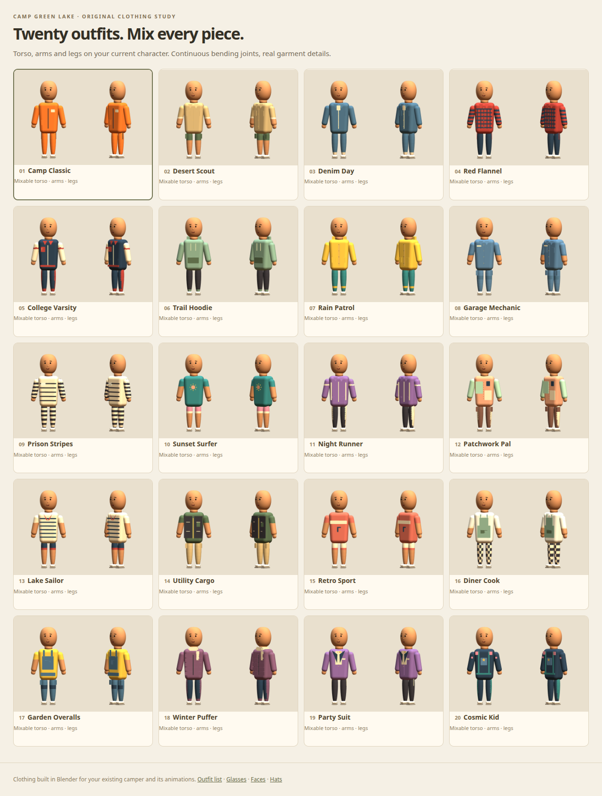

# Twenty modular outfits on the current camper

Open `/clothes-lab/` on a running game server. These are twenty Blender-authored outfit sets on JT's current
camper: **20 torso choices, 20 arm sets, 20 leg sets**. Selecting an outfit equips its three components; the
independent selectors then let you mix them. The original head, nose, hands and sneakers remain in place.
Try the original movement clips, then add any of the existing faces, hats and glasses.

| # | Outfit | Details |
| --- | --- | --- |
| 01 | Camp Classic | Familiar orange workwear with a proper zipper, chest badge and utility pockets. |
| 02 | Desert Scout | Sand button shirt, rolled sleeves and forest-green shorts. |
| 03 | Denim Day | Denim jacket with cream inset, chest pockets and turned-up jeans. |
| 04 | Red Flannel | Raised plaid shirt panels, button placket and dark jeans. |
| 05 | College Varsity | Navy varsity jacket, cream sleeves, red ribbing and a letter patch. |
| 06 | Trail Hoodie | Sage hood, drawstrings, kangaroo pocket and black joggers. |
| 07 | Rain Patrol | Yellow storm coat with folded hood, storm flap and teal trousers. |
| 08 | Garage Mechanic | Blue coveralls with tool pockets, name tag and reinforced thighs. |
| 09 | Prison Stripes | Graphic black-and-cream stripes across shirt, sleeves and trousers. |
| 10 | Sunset Surfer | Teal sun tee with peach emblem and bright pink shorts. |
| 11 | Night Runner | Purple track jacket with cream racing stripes and matching side-striped pants. |
| 12 | Patchwork Pal | Peach-and-mint sewn panels, contrast sleeves and stitched brown trousers. |
| 13 | Lake Sailor | Breton stripes, a red neckerchief and navy deck shorts. |
| 14 | Utility Cargo | Dark utility vest over an olive tee, with generous cargo pockets. |
| 15 | Retro Sport | Coral sports jersey, cream arm bands and retro athletic shorts. |
| 16 | Diner Cook | White chef shirt, sage apron and check-patterned trousers. |
| 17 | Garden Overalls | Mustard tee under blue bib overalls, shoulder straps and metal buttons. |
| 18 | Winter Puffer | Sculpted plum puffer panels, cream scarf and warm navy trousers. |
| 19 | Party Suit | Purple dinner jacket, cream shirt insert, gold bow tie and pinstripe pants. |
| 20 | Cosmic Kid | Playful space workwear with teal harness, pink panels and a star badge. |

## Blender assets

- `art/blender/clothes.blend`: one `Clothes_<number>_<slug>` scene per outfit, plus the imported source reference.
  Each outfit includes a compatible bind skeleton and native garment meshes. Fit references are linked only
  after exporting and are excluded from the GLB.
- `art/blender/clothes_options.py`: imports the current approved camper, resets its rig to the bind pose, copies
  the continuous sleeve/trouser geometry and skin weights, and authors garment materials and physical details.
  Collars, pockets, hoods, straps, lapels, badges, buttons and seams are actual meshes built in Blender.
  Short sleeves and shorts use exposed skin regions on the same continuous surface, avoiding extra open seams.
- `public/models/clothes/<number>-<slug>.glb`: one clothing-only GLB per outfit. Mesh nodes have `extras.slot`
  (`torso`, `arms`, `legs`) and base surfaces also have `extras.surface`. No head, hands, shoes, physics shapes or
  animation clips are exported. All meshes have skin weights; details follow the appropriate existing bone.
- `public/clothes-lab/manifest.json`: IDs, names, paths and source-camper SHA256. Rebuild the library if the base
  bind geometry changes; the regression test catches stale source hashes.

Rebuild with `blender --background --python-exit-code 1 --python art/blender/clothes_options.py`. The native file
is saved compressed. This does not modify `public/models/camper.glb` or `art/blender/characters.blend`.

## Runtime integration for Claude

Use the binding code in `public/clothes-lab/viewer.js` as the working example. **Clothes are skinned body-space
meshes, not rigid head-bone accessories.** Do not attach sleeves directly to elbows or legs directly to knees.

1. Clone the camper with its own skeleton using the existing game pipeline. Preserve its rig, clips, hand props,
   body variants, held items and ragdoll; these outfits introduce no new physics shapes or joint definitions.
2. Load a clothing GLB. Read each mesh's slot metadata from its node or ancestor: GLTFLoader can put multi-material
   primitives inside a group with `userData.slot` on the group. Base mesh metadata identifies the continuous limb.
3. Extract its meshes and discard the clothing reference skeleton from the runtime scene. Map clothing joint names
   to the **target camper's own bones** (Three.js sanitizes dots, so `arm.L` becomes `armL`).
4. Rebind each mesh with a new `THREE.Skeleton` whose bone array follows the clothing joint order and whose inverse
   matrices come from the corresponding original camper bones. Use the original camper mesh's bind matrix. Garment
   vertices are exported in camper bind space and their object transforms should be identity. Keeping the imported
   clothing inverse matrices can produce a mismatch because Blender may choose a different bone roll on import.
5. Hide only `CGLCamper_Torso`, `CGLCamper_Zipper`, `CGLCamper_Patch`, `CGLCamper_[LR]_Sleeve` and
   `CGLCamper_[LR]_Leg` when displaying replacements. Keep neck, hands, shoes and head. Toggle one garment source
   per slot. Apply body-width variants consistently to the corresponding new limb geometry in bind space.
6. Use the same path for player, remote player and all human NPCs, and replicate chosen component IDs if integrating
   network wardrobe selection. Ragdoll bone poses will drive the clothing because it shares the same bones.

The studio demonstrates selections and animation playback, including mixed outfit parts and all accessory sets.
It does not change gameplay wardrobe assignments or network messages. These twenty candidates are ready for JT
and Claude to review before selecting which game characters wear which components.

## Validation

`tests/clothes-assets.mjs` checks all twenty exports and the 80 continuous limb skins. It welds vertices across
material boundaries, checks closed connected topology, normalized weights and a band of blended vertices at
every elbow/knee, and verifies slots, compatible joint names and source-camper hashes.

`scripts/preview-clothes-lab.mjs` checks actual shared bone objects, original head vertices/nose, numerical arm
movement in Dig and leg movement in Sit for every outfit, independent torso/arm/leg selections, face/hat/glasses
combinations, phone controls, favorites and live animation playback. It captures desktop and phone views plus
all twenty outfits and bent poses. The browser uses the AMD Radeon 760M through Vulkan. Run `npm test` for the
full security, town, original character rig, cosmetic libraries and multiplayer smoke regression suite.
