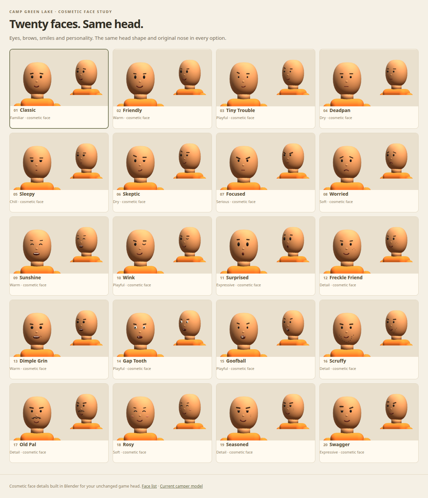

# Twenty cosmetic faces on the current head

Open `/face-lab/` on a running game server. These are face details on the exact current camper GLB: no head-shape,
nose, body, rig, animation or physics changes. The original nose stays visible, while the studio hides the old
eyes, brows and mouth and attaches a chosen face set to the existing `head` bone. All twenty hats were approved
by JT and remain in the library; the face studio can preview combinations with any approved hat.

| # | Face | Details |
| --- | --- | --- |
| 01 | Classic | Familiar dot eyes and small smile |
| 02 | Friendly | Taller bright eyes and a wider smile |
| 03 | Tiny Trouble | Tiny eyes, cocked brow, crooked grin |
| 04 | Deadpan | Straight brows and mouth |
| 05 | Sleepy | Lowered lids and relaxed features |
| 06 | Skeptic | Raised eyebrow and asymmetric smirk |
| 07 | Focused | Inward brows and a determined mouth |
| 08 | Worried | Brows raised toward the middle and a frown |
| 09 | Sunshine | Closed smiling eyes and open grin |
| 10 | Wink | One open eye and one curved wink |
| 11 | Surprised | Wide oval eyes and an O mouth |
| 12 | Freckle Friend | Six freckles and an easy smile |
| 13 | Dimple Grin | Rounded eyes, toothy grin, dimples |
| 14 | Gap Tooth | Eye whites and separated front teeth |
| 15 | Goofball | Tiny eyes and big cartoon front teeth |
| 16 | Scruffy | Chin stubble and crooked smile |
| 17 | Old Pal | Curled brown mustache and kind eyes |
| 18 | Rosy | Soft cheek color and crescent eyes |
| 19 | Seasoned | Smile lines, heavy brows and a grin |
| 20 | Swagger | One narrowed eye and asymmetric smile |

## Assets and rebuild

- `art/blender/faces.blend`: twenty `Face_<number>-<slug>` scenes. Each includes the same reference head and nose.
- `art/blender/face_options.py`: builds the facial details and exports them independently of their fit references.
- `public/models/faces/<number>-<slug>.glb`: face-only geometry in head-local metres; attach the loaded scene to
  the existing `head` bone. Retain the original nose and hide only the original Eye/Brow/Mouth/Teeth meshes.
- `public/face-lab/manifest.json`: numbered names, descriptions, paths and cosmetic-only metadata.
- `public/face-lab/`: standalone comparison studio with front/side views, rotation, full body, skin tones, approved
  hat combinations, saved picks and selected-face downloads. It uses the real camper GLB, never a rebuilt head.

Rebuild with `blender --background --python-exit-code 1 --python art/blender/face_options.py`. The native file is
saved compressed. No edits to `public/models/camper.glb` are needed for this library.

## Checks

`npm test` includes `tests/face-assets.mjs`: twenty unique face sets, no replacement head/nose/skeletons,
bounded geometry and all twenty approved hats retained. After the machine's GPU preflight, run
`FACE_URL=http://127.0.0.1:PORT/face-lab/ node scripts/preview-face-lab.mjs` against a local server. It compares
head vertices across every face, checks the original nose remains visible, face/head attachments, route/MIME/HEAD
behavior and denied paths, and exercises phone controls, saved picks and an approved hat combination.
It captures all twenty front/side previews plus desktop/phone shots; these were visually reviewed on Radeon Vulkan.

JT is reviewing the faces. These are aesthetic options; the game's player/NPC face assignments remain available
for a later cosmetic selector, with the same underlying character model and physics.
