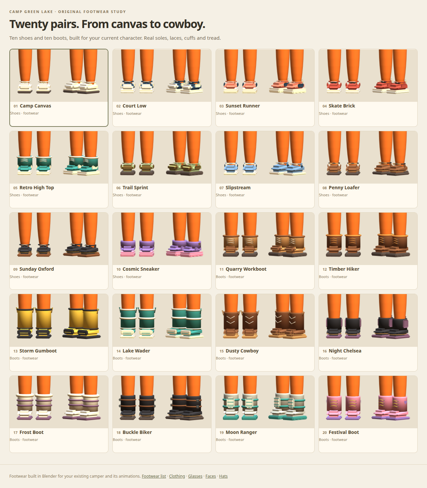

# Twenty shoes and boots for the current camper

Open `/footwear-lab/` to compare ten shoes and ten boots on JT's existing character. The studio shows close-up
front/side/back views and a full-body view with movement clips, twenty outfits (including independently mixed
torso/arms/legs), faces, hats and glasses. `/clothes-lab/` also has a shoes-and-boots selector.

| # | Pair | Type | Details |
| --- | --- | --- | --- |
| 01 | Camp Canvas | Shoes | Cream canvas lace-ups with a dark sole stripe and rounded rubber toe. |
| 02 | Court Low | Shoes | Navy court shoes with white toe panels and heel tabs. |
| 03 | Sunset Runner | Shoes | Coral runners with sculpted chunky soles and navy support panels. |
| 04 | Skate Brick | Shoes | Broad red skate shoes with black tongues and a white foxing stripe. |
| 05 | Retro High Top | Shoes | Teal high-tops with cream ankle bands and raised lace rows. |
| 06 | Trail Sprint | Shoes | Sage trail runners, gold toe guards and real outsole lugs. |
| 07 | Slipstream | Shoes | Blue slip-ons with a cream vamp strap and elastic side insets. |
| 08 | Penny Loafer | Shoes | Brown loafers with a penny strap, stitched apron and separate heel. |
| 09 | Sunday Oxford | Shoes | Black dress shoes with gold eyelets and a brown welt. |
| 10 | Cosmic Sneaker | Shoes | Purple sneakers with pink midsoles and a raised gold star. |
| 11 | Quarry Workboot | Boots | Tan work boots with reinforced toe caps, padded collars and lug soles. |
| 12 | Timber Hiker | Boots | Brown hiking boots with orange laces, metal hooks and deep tread. |
| 13 | Storm Gumboot | Boots | Tall yellow rain boots with black rims, toe bumpers and heel blocks. |
| 14 | Lake Wader | Boots | Tall teal waterproof boots with cream safety bands and side handles. |
| 15 | Dusty Cowboy | Boots | Tapered Western toes, flared shafts, pull loops and cream chevron stitching. |
| 16 | Night Chelsea | Boots | Black Chelsea boots with plum elastic panels and pull tabs. |
| 17 | Frost Boot | Boots | White winter boots with plush cream cuffs and plum wrap straps. |
| 18 | Buckle Biker | Boots | Black biker boots with two wrap straps and actual silver buckles. |
| 19 | Moon Ranger | Boots | Gray space boots with teal bands, molded front plates and segmented soles. |
| 20 | Festival Boot | Boots | Pink lace-up boots with yellow laces and violet heart patches. |

## Assets and rebuild

- `art/blender/footwear.blend`: twenty `Footwear_<number>_<slug>` scenes, with the existing camper as a fit reference.
- `art/blender/footwear_options.py`: rebuilds the original unbranded geometry and exports paired footwear independently
  of the body references. Sole layers, toe guards, laces, straps, hooks, tread, collars and badges are actual meshes.
- `public/models/footwear/<number>-<slug>.glb`: both feet in one clothing-style skinned export. Each mesh node has
  `extras.slot = "footwear"`, `extras.side = "L"` or `"R"`, and weights entirely on its matching original shin bone.
- `public/footwear-lab/manifest.json`: names, types, paths, shaft heights, source-camper hash and cosmetic metadata.

Run `blender --background --python-exit-code 1 --python art/blender/footwear_options.py`. The native file is compressed.
This does not change the approved camper GLB, body, skeleton, animation clips or physics definitions.

## Runtime binding for Claude

Follow `public/footwear-lab/viewer.js` (or the footwear loader in `public/clothes-lab/viewer.js`). Like the modular
clothes, shoe/boot vertices are in camper bind space. Extract the footwear meshes, map their joint names onto the
**target camper's own bones**, and rebind using the target's original bone inverse matrices and bind matrix. Do
not keep a second animated skeleton, or retain imported bone inverse matrices that may use different bone rolls.
Hide exactly `CGLCamper_L_Shoe`, `CGLCamper_R_Shoe`, `CGLCamper_L_Sole`, `CGLCamper_R_Sole` while replacements are
shown. Restore those originals when selecting the original sneakers. The left pair's pieces must follow `shin.L`
and the right pair's pieces `shin.R` (sanitized as `shinL`/`shinR` in Three.js).

The footwear follows the same lower-leg motion as JT's original sneakers. There is no new ankle/foot joint, foot
animation or collider. Boot shafts are hollow at the throat, fit over the default trouser legs and stop below the
original knee; they do not span the knee joint. Wider body variants should apply the appropriate bind-space
width adjustment to clothing and footwear together. Preserve per-player skeleton clones and held props.

These twenty candidates are available for review. Gameplay/NPC assignments and network wardrobe messages remain
unchanged; apply chosen footwear IDs through the shared character loader when integrating them for all humans.

## Validation

`tests/footwear-assets.mjs` verifies twenty distinct paired exports, ten shoes and ten boots, normalized weights
on the matching shin, original floor contact, bounded footprint, knee clearance and exclusion of replacement body
meshes or animation clips. The source-camper hash catches a stale rebuild after base model changes.

`scripts/preview-footwear-lab.mjs` checks actual shared bone objects and motion for every pair, original shoes hidden,
original head/nose, independent clothing mixes, accessory combinations, phone controls, favorites, animation
playback and the added footwear selector in the clothing gallery. Desktop/phone screenshots and sitting boots are
visually reviewed. Browser renders use the AMD Radeon 760M through Vulkan. `npm test` runs the full game regression
suite, including the original rig, all cosmetic libraries and multiplayer smoke.
