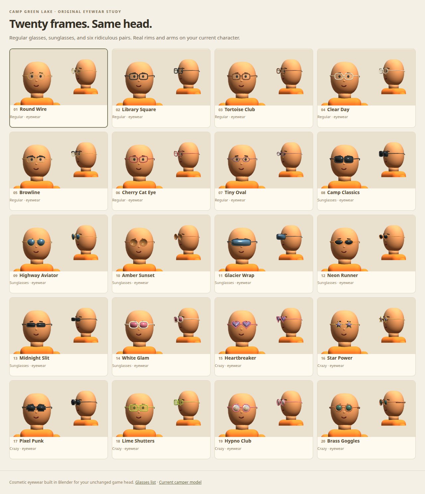

# Twenty glasses on the current camper head

Open `/glasses-lab/` on your game server. Seven regular pairs, seven sunglasses and six crazy pairs are built in
Blender on JT's unchanged head. The original nose remains visible. Every pair has actual frame geometry, a bridge,
hinges and side arms; ordinary lenses are transparent. Pick any of the twenty approved faces and hats in the studio.

| # | Pair | Group | Details |
| --- | --- | --- | --- |
| 01 | Round Wire | Regular | Fine gold circular frames with transparent lenses. |
| 02 | Library Square | Regular | Rounded black acetate frames, crisp and everyday. |
| 03 | Tortoise Club | Regular | Warm brown frames with actual amber flecks. |
| 04 | Clear Day | Regular | Pale champagne frames around barely tinted lenses. |
| 05 | Browline | Regular | Black upper rims and delicate gold lower frames. |
| 06 | Cherry Cat Eye | Regular | Upswept cherry-red frames with clear lenses. |
| 07 | Tiny Oval | Regular | Slim purple oval frames for a quieter look. |
| 08 | Camp Classics | Sunglasses | Chunky black sunglasses with dark square lenses. |
| 09 | Highway Aviator | Sunglasses | Gold teardrop aviators, blue mirror lenses and a double bridge. |
| 10 | Amber Sunset | Sunglasses | Round copper frames with warm amber-tinted lenses. |
| 11 | Glacier Wrap | Sunglasses | A wide blue mirrored shield and navy arms. |
| 12 | Neon Runner | Sunglasses | Sporty orange frames and slim dark lenses. |
| 13 | Midnight Slit | Sunglasses | Narrow black shades with a tiny straight bridge. |
| 14 | White Glam | Sunglasses | Bold cream-white acetate with rose-tinted lenses. |
| 15 | Heartbreaker | Crazy | Hot pink heart frames with violet lenses. |
| 16 | Star Power | Crazy | Gold star-shaped rims and purple-tinted lenses. |
| 17 | Pixel Punk | Crazy | Stepped black pixel frames with dark lenses. |
| 18 | Lime Shutters | Crazy | Loud green shutter shades with open slats. |
| 19 | Hypno Club | Crazy | Pink goggles with cream lenses and raised purple spirals. |
| 20 | Brass Goggles | Crazy | Copper gear rims, green lenses and a rear leather strap. |

## Assets and integration

- `art/blender/glasses.blend`: one scene per pair, with head/nose/face fit references excluded from export.
- `art/blender/glasses_options.py`: deterministic source builder. Run with `blender --background --python-exit-code 1 --python art/blender/glasses_options.py`.
- `public/models/glasses/*.glb`: eyewear-only, head-local metres. Attach the selected loaded scene to the existing
  `head` bone. Hide the original `_Shades_` accessories when adding one of these pairs. They add no skeleton,
  animations or colliders and move with the existing head bone.
- `public/glasses-lab/manifest.json`: numbered names, paths, groups and fit metadata.
- `public/glasses-lab/`: front/side/back/full-body views, rotation, skin tones, face/hat combinations, saved picks,
  and GLB downloads. It loads the exact current `public/models/camper.glb`.

JT accepted all twenty faces on 2026-10-01; their manifest and rebuild script now retain that approval, as do all
previously approved hats. These twenty eyewear candidates are available for review; the game wardrobe does not
assign them to players or NPCs automatically. Use the same bone attachment for both when integrating them.

## Validation

`tests/glasses-assets.mjs` checks twenty distinct exports, group counts, transparent ordinary lenses, brim
clearance metadata and absence of replacement head geometry, skins or animations. `scripts/preview-glasses-lab.mjs`
checks actual browser attachment, unchanged head vertices, original nose visibility, independent selection,
phone controls, combinations, saved picks, route restrictions and HEAD responses. Previews use the AMD Radeon
760M through Vulkan; Blender builds the meshes without CPU rendering. Run `npm test` for the game regression suite.
