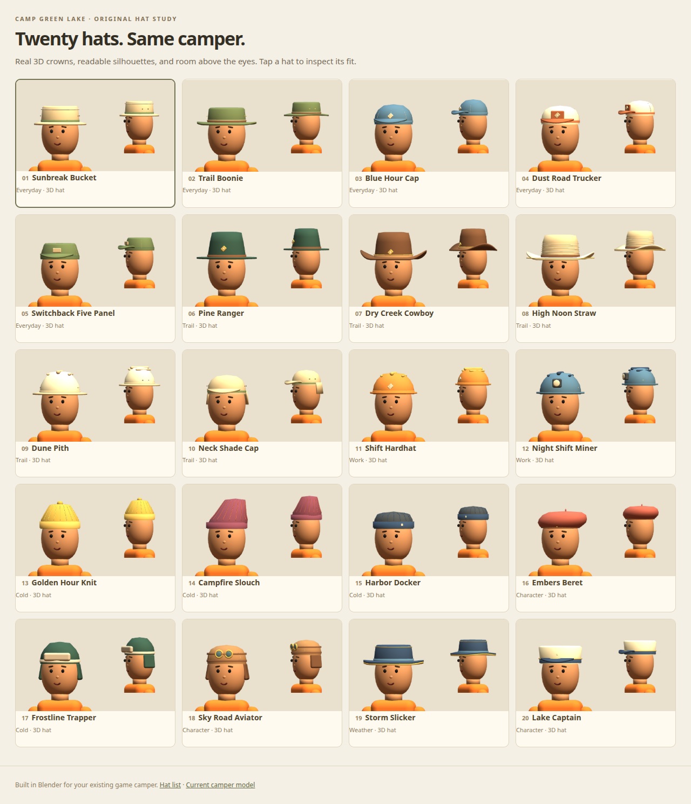

# Twenty original hats for the approved camper

[Open the comparison studio](../../public/hat-lab/index.html). On a running game server it is `/hat-lab/`.
The numbered cards show front and side views on the actual `public/models/camper.glb`, with its original skinning
and head geometry. Select a card to rotate it, inspect the full body, switch skin tones, save picks on your device
or download the selected GLB. JT approved all twenty hats on 2026-10-01. Keep the complete library; existing game role assignments remain available.

| # | Hat | Direction |
| --- | --- | --- |
| 01 | Sunbreak Bucket | Canvas crown, olive band, thick brim |
| 02 | Trail Boonie | Wide olive field hat with vents |
| 03 | Blue Hour Cap | Faded blue, curved visor, cream stitching |
| 04 | Dust Road Trucker | Cream crown, rust panel and visor |
| 05 | Switchback Five Panel | Compact sage cap with front patch |
| 06 | Pine Ranger | Tall forest crown and brass badge |
| 07 | Dry Creek Cowboy | Brown western hat with rolled brim |
| 08 | High Noon Straw | Pale woven western crown and dark band |
| 09 | Dune Pith | Cream expedition helmet with ridge |
| 10 | Neck Shade Cap | High visor and draped rear flap |
| 11 | Shift Hardhat | Orange safety shell and raised ribs |
| 12 | Night Shift Miner | Blue helmet with metal lamp housing |
| 13 | Golden Hour Knit | Mustard ribbed beanie and folded cuff |
| 14 | Campfire Slouch | Berry knit with an asymmetric crown |
| 15 | Harbor Docker | Short charcoal cap and stitched label |
| 16 | Embers Beret | Rust wool crown over a leather band |
| 17 | Frostline Trapper | Forest shell, fur front, side ear flaps |
| 18 | Sky Road Aviator | Leather cap with goggles above the eyes |
| 19 | Storm Slicker | Navy rain hat with gold lining |
| 20 | Lake Captain | Cream skipper cap with gold rope trim |

The crowns have their own volume rather than tracing the camper's scalp. All front surfaces within the eye area
start more than 0.073 model metres above the eye line. Low neck/ear flaps are restricted to the back and sides.
Brims have thickness, bands and goggles are actual geometry, and the knit ribs are continuous raised surfaces.
Each hat has fewer than 20,000 triangles; the twenty exported GLBs together are roughly 1 MB.

## Source and attachment

- Native source: `art/blender/hats.blend`, twenty `Hat_<number>-<slug>` scenes. Each includes a fit reference built
  from the same authored camper helpers. Fit references are excluded from the GLBs.
- Rebuild: `blender --background --python-exit-code 1 --python art/blender/hat_options.py`.
- Hat-only exports: `public/models/hats/<number>-<slug>.glb`.
- Names, descriptions, groups, paths and clearance measurements: `public/hat-lab/manifest.json`.
- GLBs are in head-local metres: origin at the head bone, Blender Z-up converted to glTF Y-up. Add the loaded
  hat scene to the existing `head` bone, as `public/hat-lab/viewer.js` does. Hide the old hat meshes. The complete set is approved; future game
  wardrobe assignments should preserve each NPC's identity.
- The studio loads its own renderer only and runs no game networking or world drawing. Three.js r128 and its
  GLTFLoader are vendored under the MIT license in `public/hat-lab/vendor/` so the studio can load locally.

## Validation

`npm test` includes `tests/hat-assets.mjs` for the 20 exported assets. After the machine's GPU preflight, run
`HAT_URL=http://127.0.0.1:PORT/hat-lab/ node scripts/preview-hat-lab.mjs` against a local game server. It checks
the explicit studio routes, MIME types/HEAD requests, denied paths, all 20 selections, head attachments, eye
clearance, geometry budgets and phone favorites, then captures all candidates and desktop/phone previews.
Screenshots were reviewed on the Radeon 760M using Vulkan.
