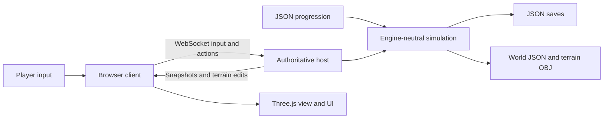

# Source architecture and expansion

## What can carry forward

The game rules, quantities, progression data, save schema, measured samples and action contracts are separated from Three.js. This provides a working reference for another engine. JavaScript rendering and networking do not import directly into Unreal; the Unreal game needs its own actors, UI, terrain and native replication. JSON world and OBJ terrain exports provide concrete interchange files.

## Material rendering (0.15)

public/materials.mjs owns the shared local image cache, UV-repeat variants, generated bark/log ends/cloth and shader extensions. Color maps use sRGB; normal, height and roughness maps remain linear data. Texture anisotropy is capped at eight and the hardware limit. Image storage is released for all related texture variants before a small neutral fallback becomes a 1K image. cloneMaterial preserves the custom shader callback/cache key for the first-person tool layer. Missing downloads fall back to neutral maps; a texture status hook reports loaded/failed maps.

Surface and mine materials use smooth normals and three-axis world projection. Low-weight axes skip samples; diffuse detail is muted, broad color variation breaks up repetition, height perturbation changes lighting, and roughness follows source maps. Creek wetness darkens shallow banks. Actual terrain density, digging, body collision, ownership and saves are unchanged. Mine strata use gradual colors instead of sharp per-vertex thresholds; vertex-color ore cues remain. Manually constructed roof/tool geometry gets UVs so the new maps actually appear.

ASSETS.md and public/assets/materials/manifest.json preserve original asset URLs, CC0 license and per-image checksums. The images and material scales can carry forward into an engine-native material graph; these Three.js shader patches and texture loading code cannot be imported as Unreal materials. Terrain OBJ exports still do not package these materials. Browser checks use software WebGL; this release does not establish a hardware frame-rate guarantee.

## Treasure hunt (0.14)

shared/relics.mjs seeds a bounded set of find records once per room: id/type/position/state/owner, plus earned income. The lifecycle is buried → exposed → carried → delivered; drops return to exposed. Exposure samples the continuous mine density or excavated surface height. Pickup validates exposure, 3.2m reach, clear line of sight, free hands and a three-slot inventory. Disconnected miners keep their finds. Map resets retain carried/delivered ownership and collection progress. Roof rubble can cover an exposed object again. Sold treasure is never recreated.

Ordinary snapshots broadcast exposed positions only. Private state contains the player's find bag and, with an owned/equipped rod, a host-calculated proximity/facing signal without a target coordinate. The world seed is shared for terrain; this is gameplay concealment, not an anti-cheat guarantee. M receives a broad sector rumor and collection state. The unique Motherlode occupies three slots, slows predicted/authoritative foot movement equally and adds a once-only 1,500,000-cent payout. Bill's transaction sells normal gold and finds together, with separate statistics.

public/relic-view.mjs renders low-poly finds and a layer-one held rod/gauge; friends see a forked rod through tool replication. Sounds and needle wobble follow authoritative strength. Drops are placed on the queried floor; this is inventory/handoff logic, not general rigid-body treasure physics or transport inside vehicles/washers. JSON preserves the complete hunt for an Unreal port. Carry forward the seeded lifecycle, exclusive ownership, price rules, signals and behavioral tests; replace rendering/input/network delivery with native engine components.

## Modules

| File | Responsibility |
| --- | --- |
| shared/rules.json | Prices, capacities, recovery, throughput, movement and equipment prerequisites |
| shared/world.mjs | Deterministic landscape, water, deposits, sampling and sparse vertex coordinates |
| shared/simulation.mjs | Inventory conservation, digging, panning, processing, buying, selling and movement |
| shared/mine.mjs | Volumetric excavation, capsule collision, ladder, mine rails/carts, shaft extensions and solo cage hoisting |
| public/mine-view.mjs | Dirty chunk surface meshes, underground lamps and rail/cage fixtures |
| shared/cargo.mjs | Proportional mass/gold transfer and weighted sample origins |
| shared/soil.mjs | Shovel plant/throw actions, placed buckets, gravity, bounce, container catching and conserved loose soil |
| shared/hauling.mjs | Authoritative wheelbarrows, slopes, braking, overloads, spills, tumbles and assistance |
| shared/console.mjs | Bounded cheat commands, bookmarks/teleports, spawning and shared flight stepping |
| shared/export.mjs | Engine-neutral world JSON and standard OBJ mesh export |
| server.mjs | HTTP/WebSocket transport, profile sessions, authoritative ticks, snapshots and persistence |
| public/client.mjs | Input, prediction, reconnect, HUD, journal, shop and telemetry |
| public/console.mjs | Hidden ~ panel, focus, command output, history and autocomplete |
| public/scene.mjs | Procedural geometry, first-person models, scenery, entity interpolation and effects |
| public/audio.mjs | Locally synthesized effects |
| tools/*.ps1 | Windows launch, friend sharing and saved shutdown |
| tests/*.test.mjs | Economy, sampling, processing, conservation, capacity and export checks |

The simulation imports no filesystem, browser or graphics API. State is plain serializable objects. All action decisions are made by the host. The client predicts movement and displays state. Decorative rocks and trees do not determine resource content.



## Quantities and coordinates

- Position: metres; Y up; X east; Z south. Origin is the centre of the valley.
- Map grid: 113 by 113 vertices at 2 metre spacing, covering -112 to +112 in X/Z.
- Sparse edits: `cells["ix,iz"] = { depth, digs }`. Height is generated height minus edited depth.
- Gravel: kg. `cargo` stores mass, contained gold in mg, and a weighted average source position.
- Recovered gold: mg. UI displays grams; 1,000 mg = 1 g.
- Treasury: integer cents. Sale proceeds are rounded down to cents.
- Processing recovery is a fraction of contained gold. A pan sample is a measured recovered yield, not a direct geological grade oracle.

The shared helpers proportionally transfer mass and gold. A cancelled pan returns its complete unprocessed sample. Each terrain point has a scoop count, so revisiting a position does not repeatedly regenerate the same first scoop.

Foot input now uses `shovelPlant` → `shovelLift` → `shovelThrow`. `bucket` places/picks up the personal cargo container. The legacy `dig` simulation action remains for existing test contracts and vehicle scoops; the browser does not send it for foot digging. Each lifted scoop lives in `player.shovel`; each thrown parcel lives in `room.clods[].cargo`. Container opening tests accept only available capacity. Misses merge into the existing recoverable spill system without changing raw gold or sample origin. Snapshots replicate clod kinematics/mass and placed bucket fill, while keeping raw gold hidden. Outside the volumetric mine claim, terrain remains a heightfield; the parcel simulation is not a full granular or rigid-body engine. See REFERENCE-AND-DIGGING.md.

## Network contract

The server listens on port 4317 and binds to all host interfaces. WebSocket endpoint: `/crew`. Server simulation: 20 Hz; snapshots: 10 Hz. Each room has its own seed, terrain edits, equipment, players and treasury.

Client messages:

```json
{"type":"join","room":"PRIVATECODE","name":"Dusty","token":"browser-profile-uuid","mode":"rush","crewSize":2}
{"type":"input","forward":1,"right":0,"yaw":-1.05,"sprint":false,"jump":false,"wash":false,"operate":null,"help":false}
{"type":"action","action":{"type":"dig","x":10,"z":40}}
{"type":"action","action":{"type":"pan"}}
{"type":"action","action":{"type":"buy","item":"rocker"}}
{"type":"action","action":{"type":"deploy","item":"rocker","x":5,"z":40,"yaw":0}}
{"type":"action","action":{"type":"interact","target":"m4"}}
{"type":"action","action":{"type":"enter","target":"v1"}}
{"type":"chat","text":"This sample looks promising."}
```

Other actions: `sell`, `pack`, `emote`, `unstuck`, `cart`, `cartBrake`, `cartTip`, `retrieve`, `crewSize`. Hauling actions use `target` IDs; crewSize uses integer `size` and is creator-only. Server messages: `welcome` (world/rules/full terrain), `snapshot` (public entities and the recipient's inventory), `terrain` (sparse edits), `effect`, `result`, `notice`, `chat`, `error`.

Snapshots include `carts`, `spills`, `crewSize`, `ownerId` and authoritative `prices`. `self.cart` identifies the held cart. `tumbleUntil`/`aid` describe recovery, and `steadier` identifies an assisting miner. Each cart has one operator. Assistance changes physical stability and recovery speed without being required for progress. Cargo is conserved when spilled; raw gold remains private. Disconnects and exports park carts and clear their operators. New saves retain the version 1 schema with additive fields; older six-player saves keep capacity six and receive a camp loaner.

Contained gold in unwashed cargo is not sent to clients. The host checks action reach, town protection, container capacity, machine placement, equipment prerequisites, money, occupied seats and transfer distances. Action results acknowledge the initiating player; shared notices inform the crew. Input expires after 600 ms to stop a disconnected player's movement or rocker operation.

## Balancing and adding equipment

Change prices, machine capacities, processing rates, recovery and prerequisites in `shared/rules.json`, then restart the host. Hand-tool effects and deposit geometry are also defined by the simulation and world modules. Changing world size requires updating the world module's grid constants as well as the rules metadata.

For a new washer, add a catalog entry with `kind: "machine"`, capacity, rate, recovery and waterReach. Add an appropriate geometry builder in `scene.mjs` and any special operator behavior in `tick`. For a new vehicle, include capacity, speed, and digging parameters where appropriate; add its model and driving/digging behavior. Preserve the transfer helpers to avoid losing or duplicating resources.

Large washers can specify `placementClearance` in metres. The host checks it and the placement preview shows invalid ground in red. When operating an excavator or hydraulic rig, the interaction picker selects washers or dump trucks for unloading; driving a truck selects nearby washers. This keeps bulk loads on the excavation/hauling/washing route.

Use a new room code when evaluating a new economy. Existing rooms keep their earned progression and equipment. Keep Gold Rush worlds separate from Machine Playground worlds.

## Unreal migration

1. Create a first-person project with multiplayer authority from the start. Keep player input as requests; let the server determine resource transactions and excavation. Epic's networking documentation describes this server-authoritative replication model. [Networking overview](https://dev.epicgames.com/documentation/unreal-engine/networking-overview-for-unreal-engine).
2. Map players to character actors, washers and vehicles to replicated actors, treasury and room milestones to GameState, and personal resources to PlayerState/inventory components. Use unreliable movement input and deliberate server calls for digging, transferring and purchasing. Replicate sparse terrain changes rather than a new full mesh every frame.
3. Convert positions to Unreal centimetres: `Unreal(X,Y,Z) = (web.x * 100, web.z * 100, web.y * 100)`. Unreal yaw in degrees is `-90 - webYawRadians * 180 / PI`.
4. Import the OBJ for a terrain reference and load exported height samples into a chunk mesh implementation. For this digging model, investigate runtime procedural/dynamic mesh components and update collision with edits. Epic documents both [UProceduralMeshComponent](https://dev.epicgames.com/documentation/unreal-engine/API/Plugins/ProceduralMeshComponent/UProceduralMeshComponent) and [UDynamicMeshComponent](https://dev.epicgames.com/documentation/unreal-engine/API/Runtime/GeometryFramework/UDynamicMeshComponent). Select and profile a runtime terrain solution before committing to a larger map.
5. Port sampling and processing rules to C++ or Blueprint components. Use the simulation tests as behavioral fixtures: a known parcel's mass, recovery and money should match after each operation. JavaScript's deterministic hash uses explicit 32-bit unsigned arithmetic; reproduce that carefully if exact generated gold must match.
6. Load the catalog into Data Assets or tables and build the UI in UMG. Replace kinematic vehicles with appropriate engine vehicle/physics components, while preserving the cargo and transfer contracts.

The heightfield represents one surface at each X/Z coordinate. It supports open pits and trenches. The mine claim now uses the volumetric design described below; expanding the rest of the valley underground requires extending that representation.

## Persistence and exports

Private saves include hashed browser profile keys for reconnecting. They remain on the host. Engine exports replace those keys with public player IDs; map them to the new engine's player identity system when importing progression. JSON interchange contains terrain heights and deposit shapes, so the terrain does not require guessing the original renderer's geometry. An exported OBJ is a static surface reference; runtime excavation still needs implementation in the target engine.

Only `public/`, `shared/` and two Three.js build files are served. Save files, host controls and source server files are outside the public routes. The host stop command uses a locally stored control key and saves before exiting. Copy `data/worlds` for full backups; exported migration files have a different identity layout.

## Verification hooks

`window.render_game_to_text()` reports visible gameplay state. `window.advanceTime(ms)` waits real time because the host owns the clock. `window.__goldfever` exposes observations and ordinary input/action hooks for browser testing; it provides no teleport or money bypass. Machine Playground is the explicit late-equipment test mode.

Mouse look requests browser pointer capture from a user gesture. Capture failure switches to right-button drag controls; it does not discard look input. `render_game_to_text().mouse` and the canvas `data-mouse-mode` expose capture/drag state. Menus and Escape release input, and the canvas takes keyboard focus when gameplay resumes.

## Midair catch and mud, version 0.5

Input carries bounded `catching`, `bucketX` and `bucketY` values. `shared/soil.mjs::heldBucketPose` is used by server collision and client rendering, including camera pitch. Catch lobs have a bounded upward impulse; descending clods pass through bucket openings before face contacts resolve. An uncaught personal catch lob makes a deliberately comic rebound toward its owner. Normal throws can strike another player's face. Every splatted parcel becomes a recoverable spill, preserving mass and contained gold.

`muddyUntil` is a server timestamp replicated per player. The local brown overlay expires against estimated server time; remote characters show mud on their faces. Repeated impacts refresh the three-second timer. First-person tools render in a separate depth pass so opaque bucket walls hide their own contents correctly without clipping through the world.

## Volumetric mines and logistics, version 0.6

The surface heightfield now has a 48 x 48m replacement claim (`MINE` in `shared/mine.mjs`), from X -88..-40 and Z -12..36, rock between Y -32 and 6. `mineSolid` combines initial solid volume, the central shaft, level landing chambers and sparse `removed["x,y,z"]` cells. Integer cells represent one cubic metre. Only the original shaft and small chambers are precut; branches are removed by validated digging. Walls, ceilings and floors are independent surfaces. The renderer hides heightfield triangles within the claim and emits only exposed voxel faces in 16m chunks; edits rebuild affected chunks and their neighbours.

`mineRay` validates a target as the first exposed rock along the eye ray. A face-level scoop removes its head and foot cells, producing a 2m-high, 1m-wide passage. Widen neighbouring columns for cart routes. Each removed cell creates 6kg of material with deterministic contained gold. Shovel, bucket, clods, spills and carts share the same cargo transfer helpers. Depth-bearing buckets/spills cannot be retrieved from another level. `mineStep` is shared capsule movement with solid-wall/ceiling collision, gravity and permanent ladder grip. Mine snapshots reconcile client XYZ to prevent a predicted camera remaining on a shaft lip while the host descends.

Save `room.mine` version 1 holds terrainRevision, removed cells, levels, tracks, carts, props and hoist. Existing version-1 world saves gain a mine lazily. Welcome sends `mineTerrain` once; subsequent cuts broadcast bounded `mineTerrain` patch arrays. Ordinary snapshots omit removed cells and hide raw cart gold. Shaft extension changes levels and rebuilds affected mesh geometry. Equipment uses normal buy/deploy actions and crew prices; terrain kits are not machine actors.

Tracks snap to 2m grid coordinates at an absolute landing Y. A clear level floor is required. Carts hold 240kg, have exclusive handles, brakes and bounded movement across adjoining rail tiles. The hoist holds one cart and up to eight riders. The empty cage can be called from either landing. Manual I/K operates from a landing or inside the cage; steam power completes the selected next landing after release. Cart loading/landing uses a forgiving alignment assist. Disconnect/save parks handles and relocates cage riders to a safe landing; the loaded cart remains recoverable in the cage. An unowned cage cart releases when a miner boards and exits at a landing.

World JSON adds `mine.volume` bounds and preserves the sparse mine topology and logistics. OBJ export omits heightfield triangles covering the claim, then writes the exposed voxel faces including underground walls/floors/ceilings. To port into Unreal, reproduce `mineSolid` from exported bounds, levels, shaft/landing geometry and sparse cells; replace chunk rendering/collision and replication with native components. Static OBJ is a geometry reference, not a runtime digging implementation. Keep material transfer and ownership tests as engine-independent behavioral contracts.

In version 0.6, timbers were visible fixtures only. Versions 0.8–0.9 below implement their structural role. Ventilation, flood simulation, autonomous cart routes, crusher/conveyor infrastructure and procedural mines outside this bounded claim remain future work.


## Continuous excavation, version 0.7

The mine now uses an analytic density field in shared/mine-terrain.mjs: negative is solid, positive is air, zero is the surface. Version 2 mine saves contain brushes[] of capsule endpoints a/b, radius, and optional sloping floor planes {x,y,z,sx,sz}. Validated aim-directed cuts are unioned with the initial shaft/landings and legacy removed cells. New cuts never snap to the old cell grid. Digging sideways forms flat passages; diagonal aim produces ramps; steep aim opens shafts. Floors and body collision sample the same density field as aiming. A spatial index limits density checks to nearby cuts.

Eight-metre mesh chunks sample at 0.5m and use marching tetrahedra with interpolated zero crossings and density-gradient normals. The sample lattice controls rendering detail, not excavation placement. Affected chunks rebuild on mineBrushes broadcasts; welcome sends all brushes. The field remains engine-neutral; in Unreal port the density function, CSG cut union, collision and chunk meshing. JSON preserves runtime cut shapes; OBJ exports the corresponding curved surface. Legacy cells remain supported without deleting saved work.

Mine passages have clipped flat/sloping floors and rounded walls. Cart tracks still snap to level two-metre grid positions; widen tunnels before building. Purchased rope ladders anchor at the player's unsnapped feet position and extend into exposed space below. Holding Space/Ctrl climbs/descends only when the player's body remains in excavated air. They persist and work for one player. The same 48x48x38m claim bounds and 4,000-cut cap remain.

## Forestry, structural supports and hand tools (0.8–0.9)

shared/world.mjs exports deterministic FOREST_TREES matching the old scene layout. shared/forestry.mjs validates trunk aim/reach, cooldown and five hits, then persists sparse tree states and collectible log piles. Player wood is a separate personal inventory. Four logs become a timber kit through shared/supports.mjs; supports cannot be purchased for cash. Round logs and linked side rails are renderer-only representations of the authoritative frames.

Mine version 3 adds risks, registeredCuts and rubble. Each new floor-clipped brush can register a roof site. Stress ticks about once a second during active play. Frames protect within 2.6 m only through clear air; undermined footings lose protection. Warning thresholds are 45/70/90 seconds. Public snapshots include only 18 nearby hazard summaries. Saves retain all sites, forest states, player wood, frames and rubble. Offline simulation freezes. This is regional hazard logic, not a geotechnical solver.

Rubble is a shrinking ellipsoid unioned as solid into the same analytic density field used by aim, collision, meshing and OBJ. mineRubble messages rebuild affected chunks. It carries 36 kg of sterile material; clearing never repeats the original cut’s gold yield. Nearby miners are moved to clear air, with their cargo preserved, so a solo player can clear and rebrace the passage.

shared/tools.mjs defines authoritative excavation profiles independent of Three.js. Server-owned upgrades choose the tier; client input chooses pick or shovel. A planted tool is captured in the gesture, preventing an input switch from enlarging an in-progress cut. Each profile changes brush radius/advance, bounded material load, cooldown and required pull. Purchases enforce personal prerequisites separately from crew machine unlocks. Personal upgrades persist in JSON and equipped profile IDs replicate to friends. The renderer shows a point pick, broad mattock or larger reinforced head; the existing conserved parcel throw/catch system handles their loads.

For Unreal, port these shared rules, forest IDs, cut/rubble density, support checks and resource transfers. Replace input, rendering, meshing and network delivery with engine systems. Exports preserve resource inventories and topology; static OBJ remains a geometry reference, not a digging runtime.


## Articulated excavator (0.10)

shared/excavator.mjs owns joint limits, targets, damped spring integration, forward kinematics and validated excavation/dump actions. Vehicles retain arm {boom,stick,slew,curl,target,velocity}; old saves lazily initialise a default pose. Client arm input is clamped by armTargets on the host and cannot supply an arbitrary world-space digging coordinate. A plant records the real teeth contact; a timed 36px pull validates ownership, surface height, region, capacity, cooldown and movement away from the original cut. It then executes the existing 180kg surface excavation. The client’s automatic excavator aim-dig loop is replaced by explicit plant/pull actions; hydraulic rig behavior is retained.

Dumping drains conserved cargo into up to twelve bounded parcels at the shared bucket lip, with gravity and bounded forward/slew impulse. Existing soil receivers catch truck/washer deliveries; overflow and misses settle into recoverable piles and can mud a nearby face. The scoop and joint spring are simplified gameplay dynamics, not a rigid-body machine or continuous bucket-volume contact solver. Excavator digging remains on surface heightfield ground; the volumetric mine is excavated with hand tools.

The Three.js model separates the upper house, boom, stick and bucket and animates a telescoping cylinder. The cab camera follows the arm and adds small velocity-based roll; right-drag provides independent looking. The operated windshield is hidden for a clear first-person view while others see it. Snapshots replicate the arm pose and load; saves retain both but clear driver/plant state on shutdown, avoiding ghost scoops on restart. JSON export clears the transient plant and preserves arm configuration/cargo for an Unreal reconstruction.


### Client timing repair (0.10.1)

Mouse/wheel handlers only update armAim; the 20 Hz frame input stream transmits the latest targets. Discrete planting/dumping actions retain ordering. Visual joint interpolation is stored separately from authoritative snapshots. Camera, chassis, joints and teeth ring share this display pose; it is never submitted as an authoritative digging location. The seated chassis uses the same local driving prediction as the cab. Upper roll is suppressed so the cab origin and model agree.

## Mechanical automation and physical feedback (0.11)

shared/automation.mjs implements per-rocker motor fitting, shared feederPose, conservative loose-pile intake and airborne output, deterministic strain/jams and fresh nearby H assistance. Motors are purchased kits installed via deploy beside an existing rocker; powered is a machine property, not a global player bonus. Packing returns the motor. Powered rockers retain their processing rate and recovery, while the client rocker() excludes them so they do not capture shovel input.

A feeder keeps cargo, processed, strain, jammed, clearProgress, helper and launchClock. Surface intake moves up to 12kg/s from nearby ground piles into its 180kg hopper; half-second output parcels move up to 6kg/s into the existing gravity/catch/spill/face system. Output is 4.4m along -Z at ground+2.65m. Clearable jams arise from >120kg hopper load, full receivers or >=24kg output piles; strain accumulates for five seconds. A fresh on-foot helper within 2.6m clears it in two seconds and ejects up to 12kg in three physical parcels. It does not mint gold or delete missed loads. The same mechanism is solo-accessible.

Host tickAutomation runs after player movement and before washer processing; inactive rooms remain suspended. Existing snapshots/JSON saves retain the machine fields and live parcels. Renderer motors, cleats, load motion and warning signs use replicated state, with bounded event particles and local catch/kick animations. Web Audio uses reusable procedural noise, limited concurrent voices, distance attenuation and stereo position. This is visual/sound feedback and simplified mechanical transport, not rigid-body collisions for every machine. H on an unheld runaway surface cart applies braking and latches the parking brake when its speed falls below .35m/s.

### Canyon geometry (0.12)

shared/canyon.mjs defines the northern canyon, walking descent and bridge deck in metres. world.mjs blends its rim into the surface. mine-terrain.mjs applies the canyon's height surface as the initial continuous solid; shared brushes carve real tunnels into it. Collision, mining rays, soil and supports query that same field. The bridge has a shared deck collider; its rails are visual. Unedited canyon chunks use 1m sampling; excavated chunks use 0.5m sampling. Only chunks intersecting exposed surfaces are built. True roof occlusion controls underground lighting. JSON export includes both mining volumes and bridge geometry metadata; OBJ includes canyon terrain. Vehicle excavation remains restricted to the surface region. shared/map-reset.mjs preserves material and equipment when clearing a saved map.

### Canyon guards (0.13)

shared/guards.mjs owns four persistent NPCs and their patrol/chase/windup/dance/recover states. Sight rays sample the actual mine density field. Pursuit uses a bounded 420-node search on a 2m floor grid, cached briefly and invalidated by target movement or terrain revisions. Final movement and knockback use mineStep, so a route never grants passage through rock. This simplified navigation is suitable for the current gorge; arbitrary narrow or stacked player-made tunnels are not universally navigable.

The host alone selects targets and resolves a single hit 420ms into the 1800ms dance, after a 1000ms windup. Hits apply 480ms of terrain-constrained push and 4200ms immunity. Up to 4kg or 15 percent of carried bucket cargo moves into a conserved loose pile; placed buckets are unaffected. Players remain in control. Offline rooms freeze. Saves retain NPC positions; loading resets attack states and player impulses. Snapshots expose four NPC poses/states, and private player state contains its push vector for shared client prediction. JSON includes NPC records; procedural character geometry is not part of terrain OBJ.

public/guard-view.mjs builds articulated clothed miners with Three.js primitives. Hip/leg/arm animation follows the replicated state clock with local interpolation between snapshots. Shared events trigger nearby shout, windup, dance and bump feedback. Port the state machine, timing, resource transfers and collision behavior into Unreal; replace the procedural visual rig and bounded route search with engine animation/navigation systems.

## Sculpted model layer (0.16)
Renderer-only miner-model.mjs and vehicle-model.mjs use model-parts.mjs cached rounded geometry, smooth materials and static mesh merging. Miner hip/body/head/limb groups retain animation pivots. Vehicle upper/boom/stick/bucket pivots match shared engine-neutral excavator geometry. Cosmetic travel rotates wheels/rollers; authoritative cargo controls fill visibility and dump animation. Tire/track/grille details use instancing; fixed same-material character siblings are merged while articulated groups remain separate. No economy, collision or save-schema changes.

## Art pipeline - 0.17
Authored static glTF files live in public/assets/nature. GLTFLoader is local, uncompressed and uses no external decoder. Forest meshes are baked to root transforms and drawn as material instances; pines switch between detailed variants within 70m and a lighter 1,646-triangle variant farther away, rebuilding only after 6m travel or a forest/terrain change. Falling copies share loaded geometry; it must not be disposed when clearing a felled instance. Shared tree IDs/roots and log economy remain authoritative. Decoration follows edited heightfields and has no new collision.
western-environment.mjs loads a local HDR texture, creates a PMREM reflection environment, updates a player-centered shadow region and disables sky/environment light underground. Both world and first-person layers retain their separate depth renders. The rock/hand-prop/model modules affect mesh presentation only. glTF models, texture maps and source licenses can be imported into a future engine independently of the renderer.
