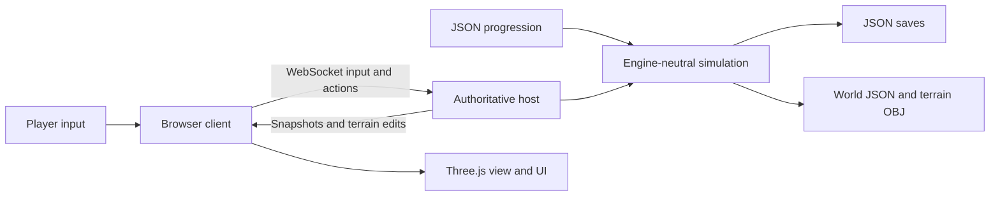

# Source architecture and expansion

## What can carry forward

The game rules, quantities, progression data, save schema, measured samples and action contracts are separated from Three.js. This provides a working reference for another engine. JavaScript rendering and networking do not import directly into Unreal; the Unreal game needs its own actors, UI, terrain and native replication. JSON world and OBJ terrain exports provide concrete interchange files.

## Modules

| File | Responsibility |
| --- | --- |
| shared/rules.json | Prices, capacities, recovery, throughput, movement and equipment prerequisites |
| shared/world.mjs | Deterministic landscape, water, deposits, sampling and sparse vertex coordinates |
| shared/simulation.mjs | Inventory conservation, digging, panning, processing, buying, selling and movement |
| shared/cargo.mjs | Proportional mass/gold transfer and weighted sample origins |
| shared/soil.mjs | Shovel plant/throw actions, placed buckets, gravity, bounce, container catching and conserved loose soil |
| shared/hauling.mjs | Authoritative wheelbarrows, slopes, braking, overloads, spills, tumbles and assistance |
| shared/console.mjs | Bounded cheat commands, bookmarks/teleports, spawning and shared flight stepping |
| shared/export.mjs | Engine-neutral world JSON and standard OBJ mesh export |
| server.mjs | HTTP/WebSocket transport, profile sessions, authoritative ticks, snapshots and persistence |
| public/client.mjs | Input, prediction, reconnect, HUD, journal, shop and telemetry |
| public/console.mjs | Hidden ~ panel, focus, command output, history and autocomplete |
| public/scene.mjs | Procedural geometry, first-person models, scenery, entity interpolation and effects |
| public/audio.mjs | Locally synthesized effects |
| tools/*.ps1 | Windows launch, friend sharing and saved shutdown |
| tests/*.test.mjs | Economy, sampling, processing, conservation, capacity and export checks |

The simulation imports no filesystem, browser or graphics API. State is plain serializable objects. All action decisions are made by the host. The client predicts movement and displays state. Decorative rocks and trees do not determine resource content.



## Quantities and coordinates

- Position: metres; Y up; X east; Z south. Origin is the centre of the valley.
- Map grid: 113 by 113 vertices at 2 metre spacing, covering -112 to +112 in X/Z.
- Sparse edits: `cells["ix,iz"] = { depth, digs }`. Height is generated height minus edited depth.
- Gravel: kg. `cargo` stores mass, contained gold in mg, and a weighted average source position.
- Recovered gold: mg. UI displays grams; 1,000 mg = 1 g.
- Treasury: integer cents. Sale proceeds are rounded down to cents.
- Processing recovery is a fraction of contained gold. A pan sample is a measured recovered yield, not a direct geological grade oracle.

The shared helpers proportionally transfer mass and gold. A cancelled pan returns its complete unprocessed sample. Each terrain point has a scoop count, so revisiting a position does not repeatedly regenerate the same first scoop.

Foot input now uses `shovelPlant` → `shovelLift` → `shovelThrow`. `bucket` places/picks up the personal cargo container. The legacy `dig` simulation action remains for existing test contracts and vehicle scoops; the browser does not send it for foot digging. Each lifted scoop lives in `player.shovel`; each thrown parcel lives in `room.clods[].cargo`. Container opening tests accept only available capacity. Misses merge into the existing recoverable spill system without changing raw gold or sample origin. Snapshots replicate clod kinematics/mass and placed bucket fill, while keeping raw gold hidden. Terrain remains a heightfield; the parcel simulation is not a full granular or rigid-body engine. See REFERENCE-AND-DIGGING.md.

## Network contract

The server listens on port 4317 and binds to all host interfaces. WebSocket endpoint: `/crew`. Server simulation: 20 Hz; snapshots: 10 Hz. Each room has its own seed, terrain edits, equipment, players and treasury.

Client messages:

```json
{"type":"join","room":"PRIVATECODE","name":"Dusty","token":"browser-profile-uuid","mode":"rush","crewSize":2}
{"type":"input","forward":1,"right":0,"yaw":-1.05,"sprint":false,"jump":false,"wash":false,"operate":null,"help":false}
{"type":"action","action":{"type":"dig","x":10,"z":40}}
{"type":"action","action":{"type":"pan"}}
{"type":"action","action":{"type":"buy","item":"rocker"}}
{"type":"action","action":{"type":"deploy","item":"rocker","x":5,"z":40,"yaw":0}}
{"type":"action","action":{"type":"interact","target":"m4"}}
{"type":"action","action":{"type":"enter","target":"v1"}}
{"type":"chat","text":"This sample looks promising."}
```

Other actions: `sell`, `pack`, `emote`, `unstuck`, `cart`, `cartBrake`, `cartTip`, `retrieve`, `crewSize`. Hauling actions use `target` IDs; crewSize uses integer `size` and is creator-only. Server messages: `welcome` (world/rules/full terrain), `snapshot` (public entities and the recipient's inventory), `terrain` (sparse edits), `effect`, `result`, `notice`, `chat`, `error`.

Snapshots include `carts`, `spills`, `crewSize`, `ownerId` and authoritative `prices`. `self.cart` identifies the held cart. `tumbleUntil`/`aid` describe recovery, and `steadier` identifies an assisting miner. Each cart has one operator. Assistance changes physical stability and recovery speed without being required for progress. Cargo is conserved when spilled; raw gold remains private. Disconnects and exports park carts and clear their operators. New saves retain the version 1 schema with additive fields; older six-player saves keep capacity six and receive a camp loaner.

Contained gold in unwashed cargo is not sent to clients. The host checks action reach, town protection, container capacity, machine placement, equipment prerequisites, money, occupied seats and transfer distances. Action results acknowledge the initiating player; shared notices inform the crew. Input expires after 600 ms to stop a disconnected player's movement or rocker operation.

## Balancing and adding equipment

Change prices, machine capacities, processing rates, recovery and prerequisites in `shared/rules.json`, then restart the host. Hand-tool effects and deposit geometry are also defined by the simulation and world modules. Changing world size requires updating the world module's grid constants as well as the rules metadata.

For a new washer, add a catalog entry with `kind: "machine"`, capacity, rate, recovery and waterReach. Add an appropriate geometry builder in `scene.mjs` and any special operator behavior in `tick`. For a new vehicle, include capacity, speed, and digging parameters where appropriate; add its model and driving/digging behavior. Preserve the transfer helpers to avoid losing or duplicating resources.

Large washers can specify `placementClearance` in metres. The host checks it and the placement preview shows invalid ground in red. When operating an excavator or hydraulic rig, the interaction picker selects washers or dump trucks for unloading; driving a truck selects nearby washers. This keeps bulk loads on the excavation/hauling/washing route.

Use a new room code when evaluating a new economy. Existing rooms keep their earned progression and equipment. Keep Gold Rush worlds separate from Machine Playground worlds.

## Unreal migration

1. Create a first-person project with multiplayer authority from the start. Keep player input as requests; let the server determine resource transactions and excavation. Epic's networking documentation describes this server-authoritative replication model. [Networking overview](https://dev.epicgames.com/documentation/unreal-engine/networking-overview-for-unreal-engine).
2. Map players to character actors, washers and vehicles to replicated actors, treasury and room milestones to GameState, and personal resources to PlayerState/inventory components. Use unreliable movement input and deliberate server calls for digging, transferring and purchasing. Replicate sparse terrain changes rather than a new full mesh every frame.
3. Convert positions to Unreal centimetres: `Unreal(X,Y,Z) = (web.x * 100, web.z * 100, web.y * 100)`. Unreal yaw in degrees is `-90 - webYawRadians * 180 / PI`.
4. Import the OBJ for a terrain reference and load exported height samples into a chunk mesh implementation. For this digging model, investigate runtime procedural/dynamic mesh components and update collision with edits. Epic documents both [UProceduralMeshComponent](https://dev.epicgames.com/documentation/unreal-engine/API/Plugins/ProceduralMeshComponent/UProceduralMeshComponent) and [UDynamicMeshComponent](https://dev.epicgames.com/documentation/unreal-engine/API/Runtime/GeometryFramework/UDynamicMeshComponent). Select and profile a runtime terrain solution before committing to a larger map.
5. Port sampling and processing rules to C++ or Blueprint components. Use the simulation tests as behavioral fixtures: a known parcel's mass, recovery and money should match after each operation. JavaScript's deterministic hash uses explicit 32-bit unsigned arithmetic; reproduce that carefully if exact generated gold must match.
6. Load the catalog into Data Assets or tables and build the UI in UMG. Replace kinematic vehicles with appropriate engine vehicle/physics components, while preserving the cargo and transfer contracts.

The heightfield represents one surface at each X/Z coordinate. It supports open pits and trenches. Underground tunnels and overhangs need a volumetric terrain design and a revised save format.

## Persistence and exports

Private saves include hashed browser profile keys for reconnecting. They remain on the host. Engine exports replace those keys with public player IDs; map them to the new engine's player identity system when importing progression. JSON interchange contains terrain heights and deposit shapes, so the terrain does not require guessing the original renderer's geometry. An exported OBJ is a static surface reference; runtime excavation still needs implementation in the target engine.

Only `public/`, `shared/` and two Three.js build files are served. Save files, host controls and source server files are outside the public routes. The host stop command uses a locally stored control key and saves before exiting. Copy `data/worlds` for full backups; exported migration files have a different identity layout.

## Verification hooks

`window.render_game_to_text()` reports visible gameplay state. `window.advanceTime(ms)` waits real time because the host owns the clock. `window.__goldfever` exposes observations and ordinary input/action hooks for browser testing; it provides no teleport or money bypass. Machine Playground is the explicit late-equipment test mode.

Mouse look requests browser pointer capture from a user gesture. Capture failure switches to right-button drag controls; it does not discard look input. `render_game_to_text().mouse` and the canvas `data-mouse-mode` expose capture/drag state. Menus and Escape release input, and the canvas takes keyboard focus when gameplay resumes.

## Midair catch and mud, version 0.5

Input carries bounded `catching`, `bucketX` and `bucketY` values. `shared/soil.mjs::heldBucketPose` is used by server collision and client rendering, including camera pitch. Catch lobs have a bounded upward impulse; descending clods pass through bucket openings before face contacts resolve. An uncaught personal catch lob makes a deliberately comic rebound toward its owner. Normal throws can strike another player's face. Every splatted parcel becomes a recoverable spill, preserving mass and contained gold.

`muddyUntil` is a server timestamp replicated per player. The local brown overlay expires against estimated server time; remote characters show mud on their faces. Repeated impacts refresh the three-second timer. First-person tools render in a separate depth pass so opaque bucket walls hide their own contents correctly without clipping through the world.
